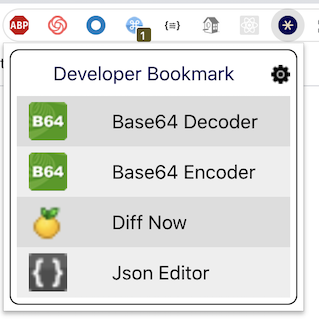

# Developer Bookmark Chrome Extension
A chrome extension for developers with link to some commonly used online tools. (Not Yet published on Chrome Store)

## How it looks
**Extension**  

**Extension Setting Page**  

## Development Setup
1. Install Node (12 or above) and git on your system.
2. Fork the repository and clone it to your local system. ([guide](https://docs.github.com/en/github/getting-started-with-github/fork-a-repo))
3. Run `npm install` to download all npm dependencies.
4. Run `npm start` for development and live preview with hot reload.
5. Run npm run build for production ready asset in build folder.
5. Follow steps mentioned [here](https://webkul.com/blog/how-to-install-the-unpacked-extension-in-chrome/) to load the extension. Select project's build folder as source while installing it into chrome.

## Contributing
See Contributing guide [here](/CONTRIBUTING.md).

## License
[Apache License Version 2.0](/LICENSE)
